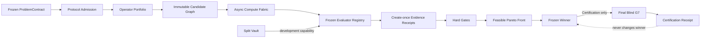

# DiscoveryOS

DiscoveryOS 是一个“证据优先”的统一算法研究内核。它把其他算法发现系统中有价值的机制重构为共享 Research Graph、Evidence Model、Candidate Store、Budget/Fidelity Controller、Memory 和异步执行底座的内部原语；官方原版系统只作为隔离 external challengers。当前版本从零实现了可运行的 **Phase 0 + Phase 1 垂直切片**：它能冻结研究协议、生成内容寻址候选、异步执行 G0/G1/G2 多保真赛马、先过硬约束再维护 Pareto front，并在 winner 冻结后通过独立命令执行 G7 final-blind 认证。

它不是把 ShinkaEvolve、AdaEvolve、EvoX 等完整 runtime 串在一起，也不让多套 population/memory/budget/evaluator 语义进入 Discovery Mode，更不把调度分数冒充科学结论。外部 adapter 只服务 Benchmark Mode 的隔离公平对照。

## 已实现

- 不可变 `ProblemContract`、`CandidateSpec`、`ExperimentSpec`、`EvidenceRecord`。
- Trial/Rung/Replicate/Attempt 身份与资源指纹；同一候选可在不同 rung、seed 和机械 retry 下拥有独立 experiment。
- evaluator、data split、contract、candidate artifact 的 SHA-256 绑定。
- create-once artifact/receipt store 与 SQLite WAL 证据账本。
- Candidate / Experiment / Evidence 统一研究图和谱系边。
- token、CPU、GPU、device、wall-time 多维预算预留、实际消耗结算和可重放的超预算拒绝记录。
- LLM input/output/cache token、子进程退出码、peak RSS、GPU/device/wall-time 使用量收据。
- fidelity 到 evaluator id/digest 的冻结绑定，不再默认使用列表中的第一个 evaluator。
- `ExecutableCandidateBundle`：冻结 base repository/commit、`patch.diff`、路径策略、entrypoint、环境锁和 build/test/evaluation 命令。
- bounded `PatchProposal`、不可变 generation request/response/provenance、Codex subscription provider 和每个 generation 最多一次的 mechanical repair。
- bounded `StructuralRewriteOperator`：从已评估的非空 lineage 触发 family shift，绑定冻结 family label 与 evidence receipts，保留 parent patch stack，并把跨 lineage component reuse 写回统一 Research Graph。
- 临时 Git worktree runner：patch 校验、mutable/forbidden/touched path 检查、硬超时进程树终止、日志与 run receipt 固化。
- 独立 `ASHAOperator`：异步 rung observation、冻结 promotion cap、Gate-feasible 排名、每 rung 最多一次机械 retry，以及 promotion/retry 决策重放。
- deterministic ASHA admission：18→6→2 三 rung、`eta=3`、每 arm 实际 CPU 54 的多 seed `Random vs ASHA` 对照。
- CPU/GPU/device 分池的异步执行底座与 backpressure。
- G0 静态准入、G1 proxy、G2 development、G7 final blind。
- 硬约束与多目标 Pareto 分离；冻结的字典序 winner rule。
- final blind capability：只有 Certification 模式中的已冻结候选可访问。
- 原始收据重放：重新执行冻结 evaluator，并核对 contract/evaluator/data/candidate 绑定。
- semantic delta memory 与 progressive context builder 基础接口。
- 可插拔 evaluator/operator 接口和一个完整、确定性的近场净空演示域。

## 端到端运行

只依赖 Python 3.11+ 标准库。在 PowerShell 中：

```powershell
$env:PYTHONPATH = "src"
python -m discoveryos demo-discovery --workspace runs/clearance-demo
python -m discoveryos status --workspace runs/clearance-demo
python -m discoveryos demo-certify --workspace runs/clearance-demo
python -m discoveryos demo-replay --workspace runs/clearance-demo
python -m discoveryos asha-admission --workspace runs/asha-admission --seeds 12
python -m discoveryos local-patch-admission --workspace runs/local-patch-admission --model gpt-5.4
```

也可以安装为本地命令：

```powershell
python -m pip install -e .
discoveryos demo-discovery --workspace runs/clearance-demo
```

关键行为：

1. `demo-discovery` 只产生 G0/G1/G2 收据，`blind_receipt_count` 必须为 `0`。
2. G2 后按冻结 winner rule 选择一次 winner，并写入 create-once 决策记录。
3. `demo-certify` 只评估这个已冻结 winner，不允许根据 blind 结果换候选。
4. `demo-replay` 对所有收据重新执行 evaluator 并精确比较输出。

测试：

```powershell
$env:PYTHONPATH = "src"
python -m unittest discover -s tests -v
```

## 权限与数据流



## 当前边界

这是可信研究内核，不是整份远景设计已经全部完成。bounded LLM Local Patch 已实现但尚未通过算法准入；Structural Rewrite / Basin-Jump 已有共享 CandidateBundle/ledger/runner 的 mechanics vertical slice，但尚无 fresh-task search-value evidence。尚未实现或未获授权的主要能力包括统一 action acquisition、BOHB/qNEHVI、Portfolio、component-effect credit、G3–G6 的正式策略、远端 GPU/device worker、外部 challenger adapter、生产级 blind isolation、Meta-Strategy Evolver 和学习型 Advisor。

当前 `SplitVault` 是 fail-closed 的应用能力边界，能阻止正常 worker 通过系统 API 读取 blind；`IsolatedRepositoryRunner` 提供临时 worktree 和独立子进程，但它同样不是 hostile-code 安全沙箱。真实数据认证必须把 final-blind vault 部署为独立服务或独立系统身份，只向认证 worker 返回受控结果。

Executable evaluation 命令必须把单个 JSON object 写到 stdout 的最后一行：

```json
{
  "metrics": {"objective": 0.42},
  "usage": {
    "llm_input_tokens": 0,
    "llm_output_tokens": 0,
    "llm_cache_tokens": 0,
    "gpu_seconds": 0.0,
    "device_seconds": 0.0
  }
}
```

runner 通过 `DISCOVERYOS_DATA_PATH`、`DISCOVERYOS_FIDELITY`、`DISCOVERYOS_SEED`、`DISCOVERYOS_TRIAL_ID` 和 `DISCOVERYOS_RUNG_ID` 提供冻结执行上下文。命令以 argv vector 直接启动，不经过 shell。

R1.0-A synthetic admission 的冻结协议、结果与限制见 [ASHA admission 记录](docs/ASHA_ADMISSION.md)。R1.0-B 已实现 bounded LLM Local Patch、一次 mechanical repair、generation provenance/token accounting 与 matched-token real-code benchmark；详见 [Local Patch admission 记录](docs/LLM_LOCAL_PATCH_ADMISSION.md)。[R1.0-BR-A fresh readmission](docs/LLM_LOCAL_PATCH_RELIABILITY.md) 已在 8 个冻结 task 上完成：reliability PASS，但 One-shot 与 Iterative 均为 8/8、paired 0 胜 8 平 0 负，search-value FAIL，因此正式 verdict 继续是 `LLM_LOCAL_PATCH_NOT_ADMITTED`。当前实现优先级是把 Local Patch、Structural Rewrite / Basin-Jump 与已实现的 ASHA budget mechanism 接成第一个 Search-Value MVP，再做远端并行和严格 matched-resource benchmark。[R1.0-SP-A](docs/SEARCH_POLICY_ADMISSION.md) 只保留为防止任务筛选污染的最小 benchmark guard，不再作为独立产品阶段；它目前仍是 `SEARCH_POLICY_PROTOCOL_ONLY`。总体架构、内部机制与 external challenger 的边界见 [架构与路线图](docs/ARCHITECTURE.md)。
