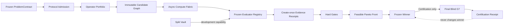

# DiscoveryOS

DiscoveryOS 是一个“证据优先”的算法研究操作系统内核。当前版本从零实现了可运行的 **Phase 0 + Phase 1 垂直切片**：它能冻结研究协议、生成内容寻址候选、异步执行 G0/G1/G2 多保真赛马、先过硬约束再维护 Pareto front，并在 winner 冻结后通过独立命令执行 G7 final-blind 认证。

它不是把 ShinkaEvolve、AdaEvolve、EvoX 等系统串在一起，也不把调度分数冒充科学结论。

## 已实现

- 不可变 `ProblemContract`、`CandidateSpec`、`ExperimentSpec`、`EvidenceRecord`。
- evaluator、data split、contract、candidate artifact 的 SHA-256 绑定。
- create-once artifact/receipt store 与 SQLite WAL 证据账本。
- Candidate / Experiment / Evidence 统一研究图和谱系边。
- token、CPU、GPU、device、wall-time 多维预算预留。
- CPU/GPU/device 分池的异步执行底座与 backpressure。
- G0 静态准入、G1 proxy、G2 development、G7 final blind。
- 硬约束与多目标 Pareto 分离；冻结的字典序 winner rule。
- final blind capability：只有 Certification 模式中的已冻结候选可访问。
- 原始收据重放：重新执行冻结 evaluator，并核对 contract/evaluator/data/candidate 绑定。
- semantic delta memory 与 progressive context builder 基础接口。
- 可插拔 evaluator/operator 接口和一个完整、确定性的近场净空演示域。

## 端到端运行

只依赖 Python 3.11+ 标准库。在 PowerShell 中：

```powershell
$env:PYTHONPATH = "src"
python -m discoveryos demo-discovery --workspace runs/clearance-demo
python -m discoveryos status --workspace runs/clearance-demo
python -m discoveryos demo-certify --workspace runs/clearance-demo
python -m discoveryos demo-replay --workspace runs/clearance-demo
```

也可以安装为本地命令：

```powershell
python -m pip install -e .
discoveryos demo-discovery --workspace runs/clearance-demo
```

关键行为：

1. `demo-discovery` 只产生 G0/G1/G2 收据，`blind_receipt_count` 必须为 `0`。
2. G2 后按冻结 winner rule 选择一次 winner，并写入 create-once 决策记录。
3. `demo-certify` 只评估这个已冻结 winner，不允许根据 blind 结果换候选。
4. `demo-replay` 对所有收据重新执行 evaluator 并精确比较输出。

测试：

```powershell
$env:PYTHONPATH = "src"
python -m unittest discover -s tests -v
```

## 权限与数据流



## 当前边界

这是可信研究内核，不是整份远景设计已经全部完成。尚未实现的主要能力包括 BOHB/qNEHVI、LLM Local Patch/Rewrite、跨分支组件迁移、G3–G6 的正式策略、shadow 查询预算、容器/独立 OS 账号级的 hostile-worker 隔离、远端 GPU/device worker、Meta-Strategy Evolver、外部 challenger adapter 和学习型 Advisor。

当前 `SplitVault` 是 fail-closed 的应用能力边界，能阻止正常 worker 通过系统 API 读取 blind；它不能把同一 OS 用户下的恶意任意代码变成安全沙箱。真实数据认证必须把 final-blind vault 部署为独立服务或独立系统身份，只向认证 worker 返回受控结果。

下一阶段及正式扩展点见 [架构与路线图](docs/ARCHITECTURE.md)。
